

  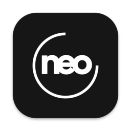

<h1 align="center">Neotime</h1>

  Le chrono de Neoffice, sur Mac et Windows. 
  <a href="https://github.com/bvisible/neoffice-desktop-releases/releases/latest"><strong>Télécharger la dernière version</strong></a>

<picture>
  <source media="(prefers-color-scheme: dark)" srcset="images/neotime-hero-dark.webp">
  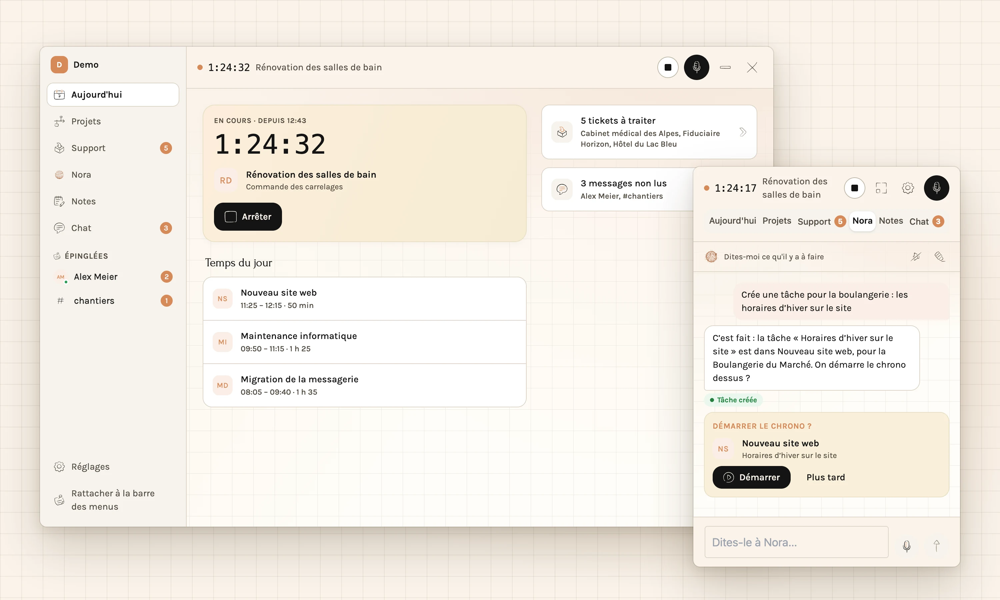
</picture>

Neotime vit dans la barre des menus du Mac et dans la zone de notification de Windows. Un clic démarre le chrono sur une tâche, Neotime reconnaît sur quoi vous travaillez, et chaque heure arrive dans Neoffice, sur le bon projet. Le support, Nora, les notes et le chat de l'équipe sont à portée de clic.

## Télécharger

Version actuelle : **0.5.2** — [toutes les versions](https://github.com/bvisible/neoffice-desktop-releases/releases)

| Ordinateur | Fichier |
| --- | --- |
| Mac avec puce Apple (M1 et suivants) | [neoffice-desktop-0.5.2-arm64.dmg](https://github.com/bvisible/neoffice-desktop-releases/releases/download/v0.5.2/neoffice-desktop-0.5.2-arm64.dmg) |
| Mac avec processeur Intel | [neoffice-desktop-0.5.2-x64.dmg](https://github.com/bvisible/neoffice-desktop-releases/releases/download/v0.5.2/neoffice-desktop-0.5.2-x64.dmg) |
| Windows 10 et 11 | [neoffice-desktop-0.5.2-setup.exe](https://github.com/bvisible/neoffice-desktop-releases/releases/download/v0.5.2/neoffice-desktop-0.5.2-setup.exe) |

Sur Mac, macOS 12 ou plus récent. Pour savoir quel Mac vous avez : menu Pomme, « À propos de ce Mac », ligne « Puce » ou « Processeur ».

## Installer

**Mac** : ouvrez le fichier `.dmg` et glissez Neotime dans Applications. Neotime est signée, mais pas encore notarisée : à la première ouverture, macOS peut la bloquer. Ouvrez alors Réglages Système, Confidentialité et sécurité, et cliquez sur « Ouvrir quand même ». Une seule fois.

**Windows** : lancez `neoffice-desktop-<version>-setup.exe`. Si Windows affiche « Windows a protégé votre ordinateur », choisissez « Informations complémentaires », puis « Exécuter quand même ». Neotime s'ouvre à la fin de l'installation ; son icône rejoint la zone de notification, et Neotime propose de l'afficher dans la barre des tâches.

## Premier lancement

1. Saisissez l'adresse de votre Neoffice, par exemple `moninstance.neoffice.me`.
2. Connectez-vous avec votre compte Neoffice.

Si Neotime indique que l'instance n'est pas prête : un administrateur ouvre Neoffice dans le navigateur, clique sur le menu en haut à gauche, puis sur « Applications mobiles » et « Configurer le client OAuth ». C'est le même réglage que pour l'application mobile, à faire une fois.

Pour compter vos heures, il faut une fiche employé dans Neoffice ; si elle manque, Neotime propose de la créer quand vos droits le permettent. Les agents du helpdesk ont l'onglet Support, même sans fiche employé.

## Ce que fait Neotime

### Le chrono, sous l'icône

Un clic sur l'icône ouvre Neotime. Choisissez un projet et sa tâche : le chrono démarre, et le temps s'affiche à côté de l'icône. À l'arrêt, la tranche rejoint votre feuille de temps du jour dans Neoffice, même si le réseau a manqué entre-temps.

<picture>
  <source media="(prefers-color-scheme: dark)" srcset="images/neotime-popover-today-dark.webp">
  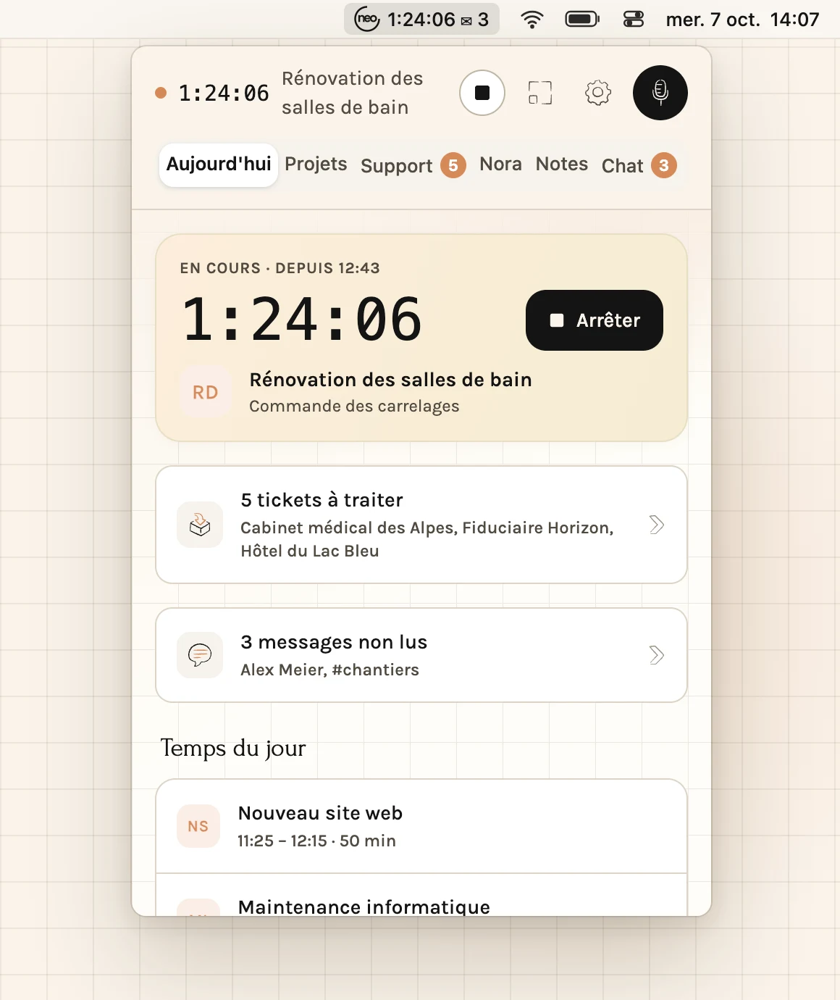
</picture>

### La fenêtre, quand il faut de la place

Le bouton à côté des réglages détache Neotime en fenêtre : les onglets passent dans une barre latérale, la journée s'étale sur deux colonnes. Sous les onglets, les conversations que vous avez épinglées. La croix la ferme et la remet sous son icône ; « — » la réduit dans le Dock, ou dans Stage Manager s'il est actif. En haut de la barre latérale, le logo Neoffice ; tout en bas, l'instance ouverte. Par défaut, Neotime s'ouvre toujours sous l'icône.

<picture>
  <source media="(prefers-color-scheme: dark)" srcset="images/neotime-window-today-dark.webp">
  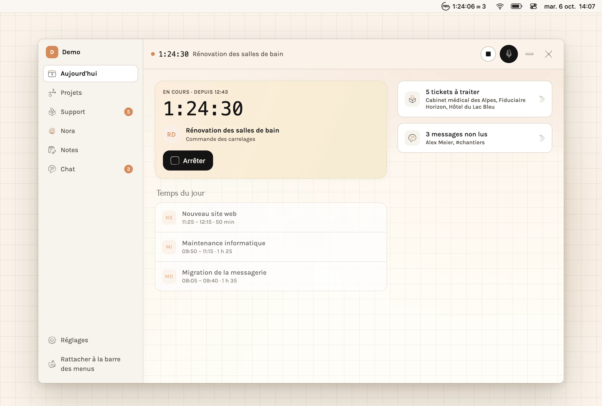
</picture>

### Les projets et la détection

Les projets où vous comptez vos heures, chacun avec « Démarrer ». Une règle peut relier une application ou un site à un projet : un plan ouvert dans AutoCAD, une maquette dans Figma, le site d'un client. Neotime propose alors de démarrer, ou démarre toute seule. La détection est éteinte tant que vous ne l'activez pas, et ce qu'elle lit reste sur votre ordinateur.

<picture>
  <source media="(prefers-color-scheme: dark)" srcset="images/neotime-window-projects-dark.webp">
  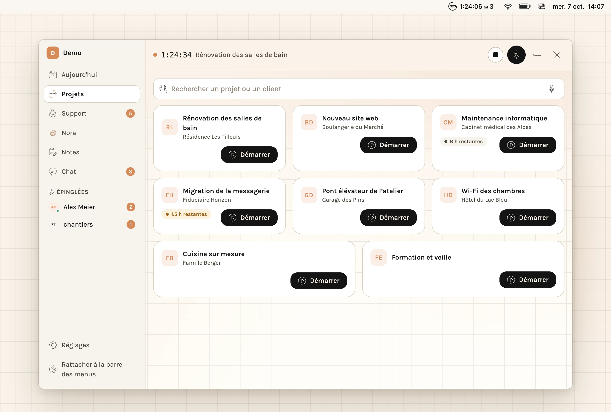
</picture>

### Le support

Les tickets du helpdesk qui vous attendent, la conversation avec le client et vos notes internes. « Prendre et commencer » démarre le chrono sur la tâche du ticket, et les heures se décomptent du forfait du client. Répondez au client, ajoutez une note, résolvez : sans ouvrir le helpdesk.

<picture>
  <source media="(prefers-color-scheme: dark)" srcset="images/neotime-window-support-dark.webp">
  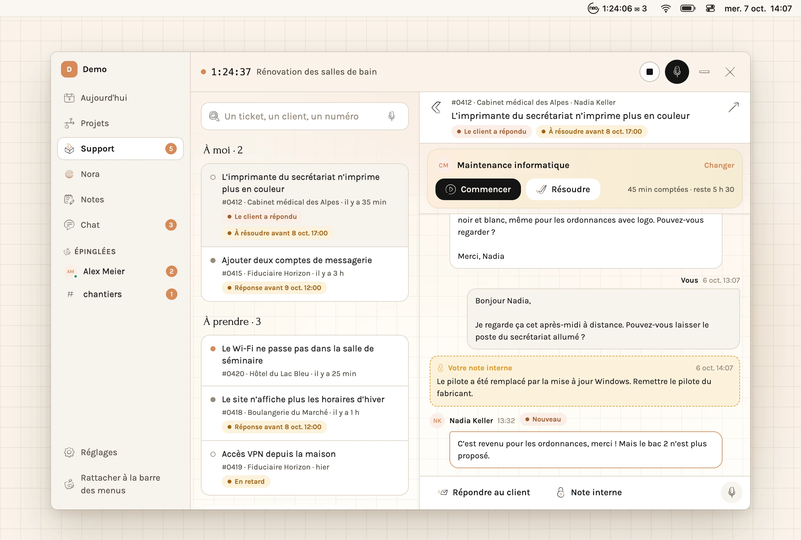
</picture>

### Nora

Parlez ou écrivez : « Crée une tâche pour la boulangerie ». Nora trouve le projet, crée la tâche et propose de démarrer le chrono. « C'est terminé » l'arrête et clôt la tâche.

<picture>
  <source media="(prefers-color-scheme: dark)" srcset="images/neotime-popover-nora-dark.webp">
  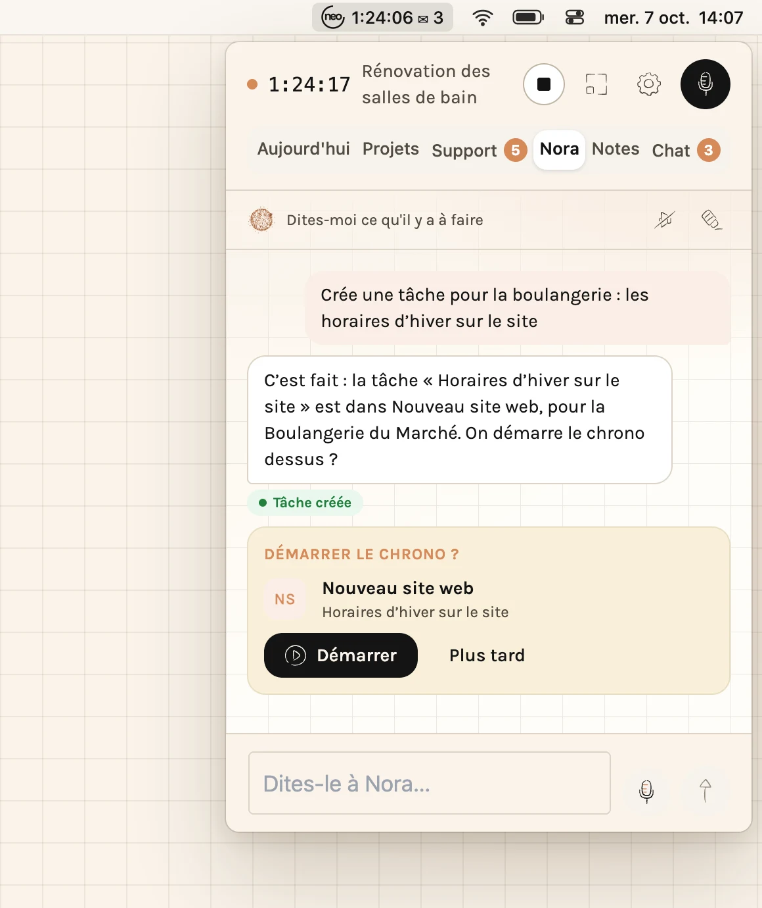
</picture>

### Les notes

Écrivez ou dictez une note, avec sa mise en forme. « Enregistrer » la garde telle quelle ; « Organiser avec Nora » lui donne un titre, un résumé et les tâches à cocher, que vous rattachez au projet.

<picture>
  <source media="(prefers-color-scheme: dark)" srcset="images/neotime-window-notes-dark.webp">
  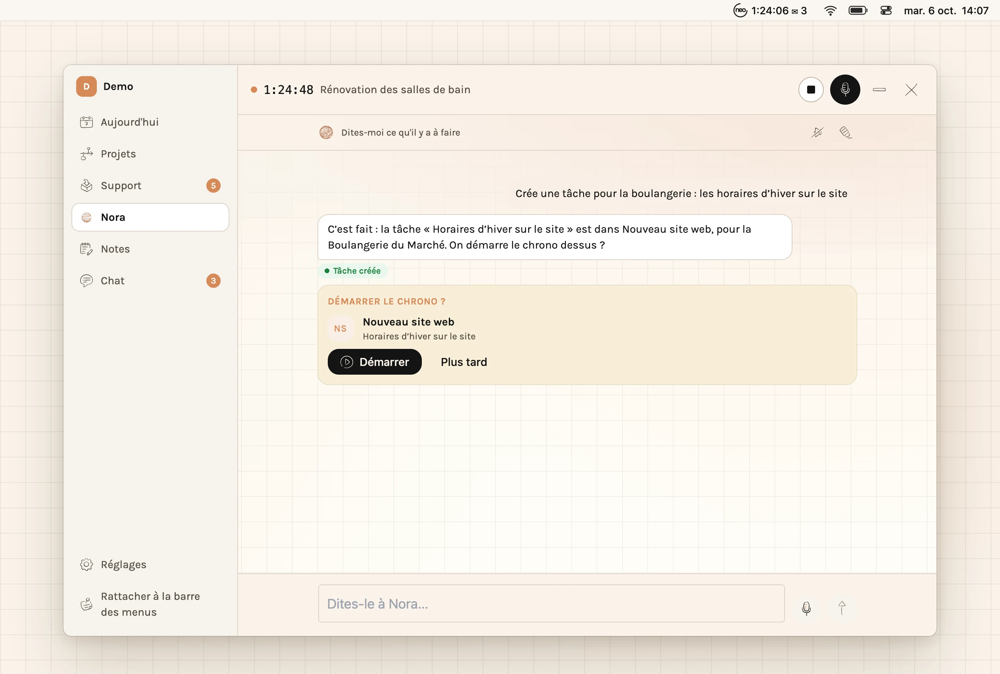
</picture>

### Le chat

Les canaux et les messages directs de Neoffice, avec la mise en page, les fichiers et les notifications. Sur Mac, on répond depuis la notification. En fenêtre, l'épingle de l'en-tête d'une conversation la met dans la barre latérale, à un clic : ce sont les mêmes épinglées que dans la messagerie de Neoffice. Un double-clic sur un message y met un 👍, comme sur le téléphone ; au survol, quatre autres réactions.

<picture>
  <source media="(prefers-color-scheme: dark)" srcset="images/neotime-window-chat-dark.webp">
  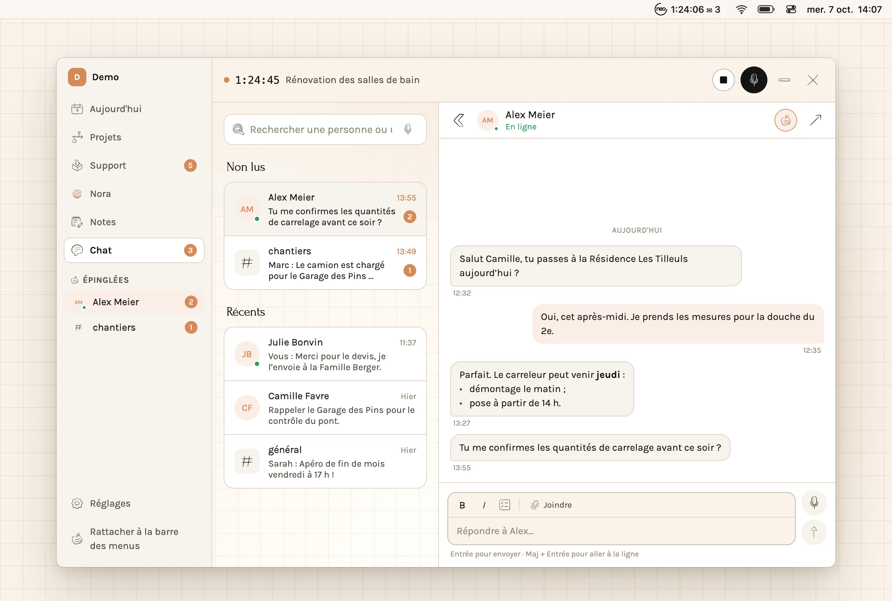
</picture>

### Sur Windows

La même Neotime, dans la zone de notification, juste au-dessus de la barre des tâches.

<picture>
  <source media="(prefers-color-scheme: dark)" srcset="images/neotime-windows-dark.webp">
  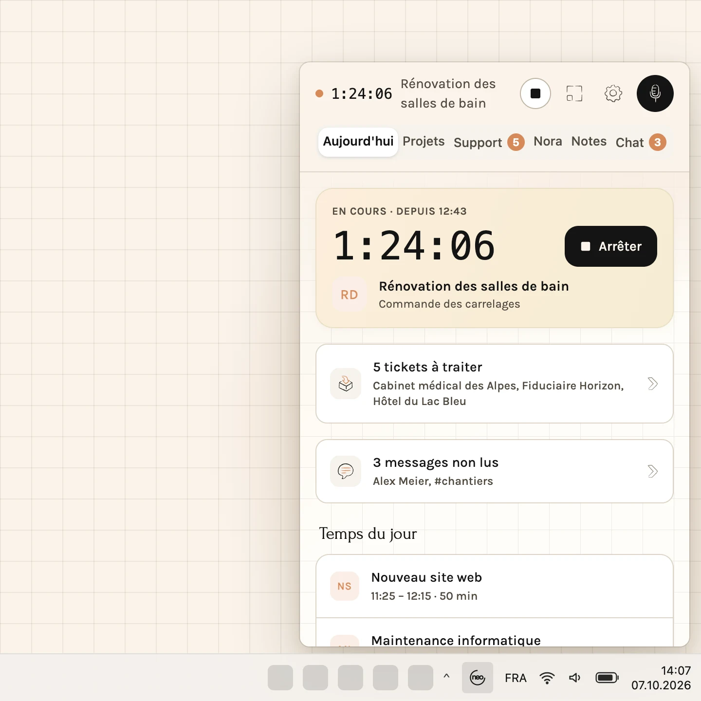
</picture>

## Mises à jour

Neotime cherche une nouvelle version au démarrage, puis toutes les 6 heures, et la télécharge toute seule. Les Réglages disent où elle en est : recherche, téléchargement, prête, à jour. Une version téléchargée s'installe à la fermeture de Neotime, ou tout de suite avec « Redémarrer et installer ».

<picture>
  <source media="(prefers-color-scheme: dark)" srcset="images/neotime-popover-settings-dark.webp">
  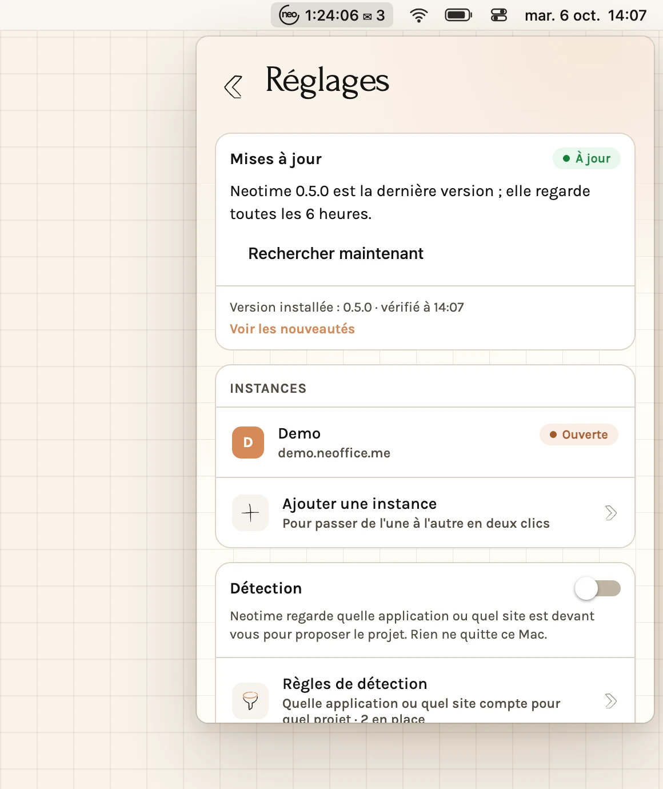
</picture>

## Questions fréquentes

**Neotime fonctionne-t-elle sans connexion ?** Le chrono, oui : les tranches de temps attendent le réseau et partent toutes seules dès qu'il revient.

**Que lit la détection ?** L'application au premier plan et le titre de sa fenêtre, et sur Mac l'adresse de la page ouverte dans le navigateur, pour les comparer à vos règles. Rien de ce qu'elle lit ne quitte votre ordinateur.

**Plusieurs Neoffice ?** Ajoutez-les dans les Réglages et passez de l'une à l'autre. Un seul chrono tourne, toutes instances confondues.

**Comment désinstaller ?** Mac : quittez Neotime (Réglages, « Quitter Neotime ») et glissez-la à la corbeille. Windows : Paramètres, Applications, Neotime, Désinstaller.

---

Ce dépôt ne contient que les installeurs et les fichiers que Neotime lit pour se mettre à jour ; le code source est privé. Les images montrent des données fictives.
